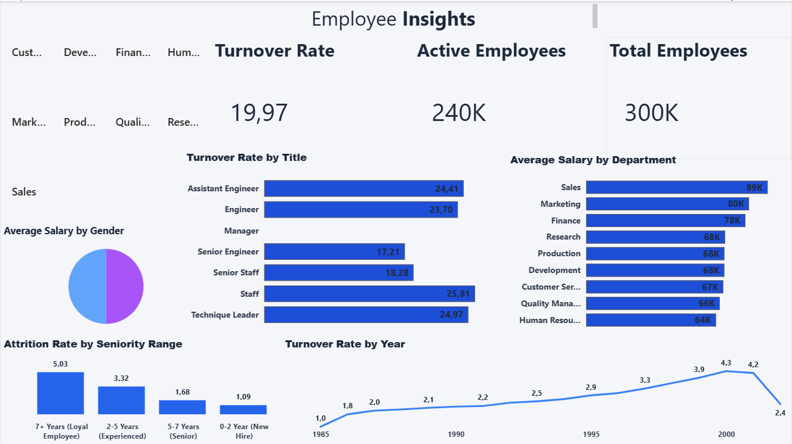
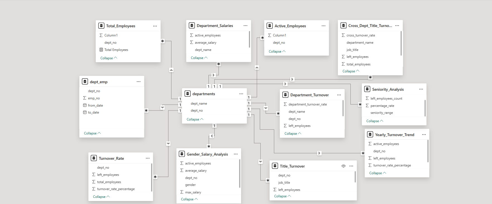

# HR Analytics: Employee Turnover Analysis with SQL & Power BI

## 📌 Project Overview

This project explores employee turnover using a multi-table HR dataset containing approximately 300,024 unique employee records. SQL Server was used to perform business-oriented analyses, and the results were visualized through an interactive Power BI dashboard to support HR decision-making.

---

## 🎯 Business Problem

Employee turnover is one of the most important HR metrics.

The objective of this project is to identify patterns behind employee turnover and answer business questions such as:

- Which departments experience higher turnover?
- Which job titles are more likely to leave?
- Does salary explain employee turnover?
- Which employee groups are at greater risk of leaving?

---

## 🗂 Dataset

- Source: [Kaggle](https://www.kaggle.com/datasets/isissantoscosta/365ds-practice-exams-people-analytics-dataset/data)
- Approx. 300,024 unique employee records
- Multi-table relational dataset

Main tables:

- Employees
- Departments
- Department Employees
- Department Manager
- Titles
- Salaries

---

## 🛠 Tools & Technologies

- SQL
- Power BI
- Data Modeling

---

## 📊 Analysis Performed

- Overall Employee Turnover
- Department Turnover Analysis
- Job Title Turnover Analysis
- Department × Job Title Analysis
- Yearly Turnover Trend
- Average Salary by Department
- Gender-based Salary Analysis
- Employee Tenure Analysis

---

## 🔍 Key Insights

- Overall employee turnover rate: 19.97%
- Turnover rates were relatively consistent across departments.
- Manager positions recorded no employee exits.
- Employees with 7+ years of tenure showed the highest turnover.
- Male and female employees had similar average salaries.
- Salary alone did not appear to explain turnover differences between departments.

---

## 📈 Dashboard

---

## 📂 Repository Contents

- README.md
- HR_Analytics_SQL_Queries.sql
- HR_Analytics.pbit
- dashboard.png
- data_model.png

---

## 🚀 Skills Demonstrated

- SQL Joins
- Aggregate Functions
- Subqueries
- CASE WHEN
- GROUP BY & WITH ROLLUP
- Window Functions
- Data Modeling
- HR Analytics
- Dashboard Design

## 📂 Power BI Data Model

A star-schema-like relational model was created in Power BI by connecting the SQL outputs through the `Departments` table using one-to-many relationships.

This model enabled department-level filtering across all visualizations and ensured consistent interaction between reports.

---

## 👨‍💻 Author

**Furkan Hacıoğulları**

## 🤝 Feedback

Feedback and suggestions are always welcome.

If you have any questions or recommendations, feel free to connect with me on LinkedIn.
